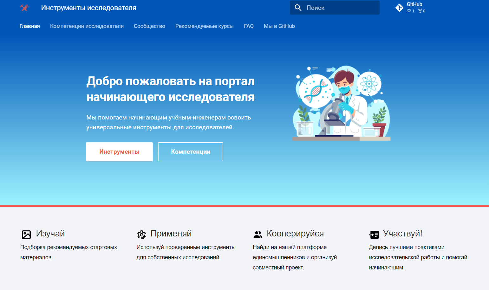
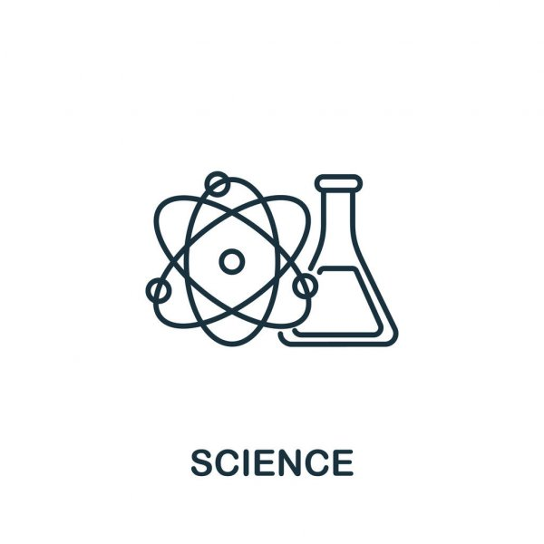
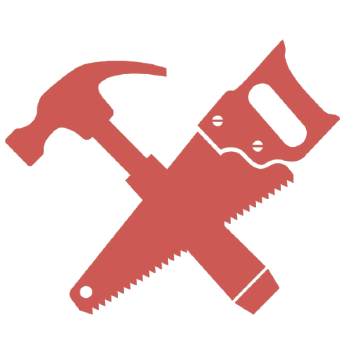
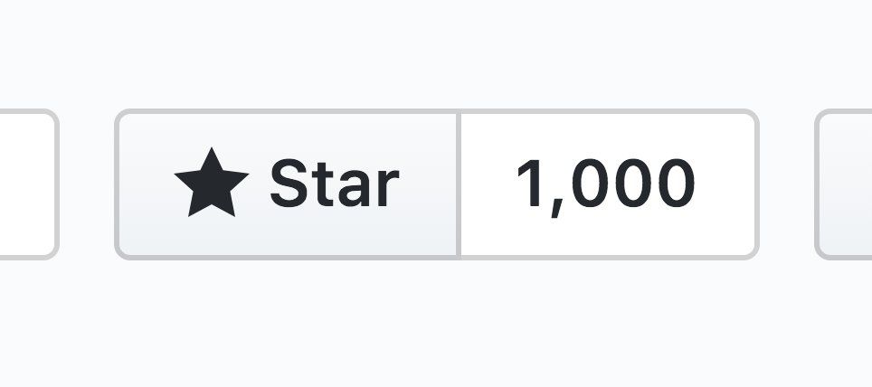

# <!--fit--> Инструменты исследователя

Открытая коллаборативная платформа Консорциума Университетов

[github.com/research-instruments](https://github.com/research-instruments/)

[Наш сайт](https://research-instruments.github.io/)

---

---

##### <!--fit--> Стань амбассадором инструментов открытой науки

##### <!--fit--> 👉 Активные контрибьюторы будут приняты в   команду администраторов площадки

---
## **Создавай**

####  учебные материалы для начинающих исследователей
Составь и размести авторский урок для освоения используемых тобой научных инструментов

---

## **Организуй**

#### коллективный проект разработки утилит для науки на межуниверситетской github-площадке

Привлеки помощников в разработке и управляй командой в [github projects](https://github.com/orgs/research-instruments/projects?type=beta)

---

## **Рекомендуй**

#### избранные курсы, полезные для исследователя

[Дополняй наш каталог учебных online-материалов](https://research-instruments.github.io/catalogue/)

---

## **Участвуй**

#### в создании межуниверситетского манифеста открытой науки

Помоги сформулировать основные ценности сообщества исследователей-естественников

---

## **Обсуждай**

#### на нашем форуме лайфхаки для успешной научной деятельности

Помоги начинающим исследователям подобрать оптимальные инструменты, отвечая на вопросы

---

## **Детализируй**

#### карту ключевых компетенций современного исследователя

Помоги разработать [реестр важнейших навыков](https://research-instruments.github.io/skills/) для успешной карьеры ученого. Предложи своё видение

---

## **Делись**

#### полезными "трафаретами" с сообществом

[Размещай](https://research-instruments.github.io/network/) полезные шаблоны LaTeX для публикаций, постеров, отчетов

---

## **Расскажи**

#### сообществу о любимых online-сервисах для исследователя

[Поделись опытом](https://research-instruments.github.io/network/) использования наукометрических систем, соцсетей для ученых, свободнораспространяемых инструментов, и пр.

---

## **Предлагай**

#### идеи для развития платформы

и попади в команду межуниверситетского открытого сообщества исследователей

[Поставь звездочку нашему проекту](https://github.com/research-instruments/research-instruments.github.io)

---

##### <!--fit--> Остались вопросы?

##### <!--fit--> 👉 Читай [руководство по работе с платформой](https://research-instruments.github.io/help/)    [Напиши нам](mailto:rosatom-dev@mephi.ru)

